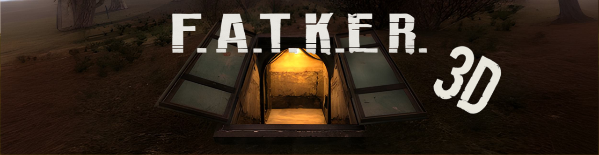

# F.A.T.K.E.R. — NFT Collection Site

Official landing page for the **F.A.T.K.E.R.** NFT project  
**Feline Artifact Territory: Kawaii Exploration Regiment**

## 🌍 Description

**RU:**  
В постапокалиптической Зоне отчуждения больше нет людей. Только коты. Толстенькие, суровые и невероятно милые. Они делят территорию, охотятся за артефактами и воюют между собой в вечной борьбе между фракциями и… ленью.

**EN:**  
In the post-apocalyptic Exclusion Zone, no humans remain. Only cats. Chubby, grumpy, and unbearably cute. They divide territory, hunt for artifacts, and wage war — caught in an eternal struggle between factions... and naps.

---

## 🔗 Links

- 🔥 NFT Collection: [on Getgems](https://getgems.io/collection/FATKER)
- 📬 Contact Author: [on Telegram](https://t.me/by3069603)

---

## 🛠 Deploy on GitHub Pages

1. Fork or clone the repo
2. Push to `main` branch
3. Go to **Repository Settings → Pages → Source → Deploy from `main`**
4. Your site will be available at `https://3069603.github.io/fatker-3d/`

---

## 👤 Author

- GitHub: [3069603](https://github.com/3069603)
- Telegram: [@by3069603](https://t.me/by3069603)
